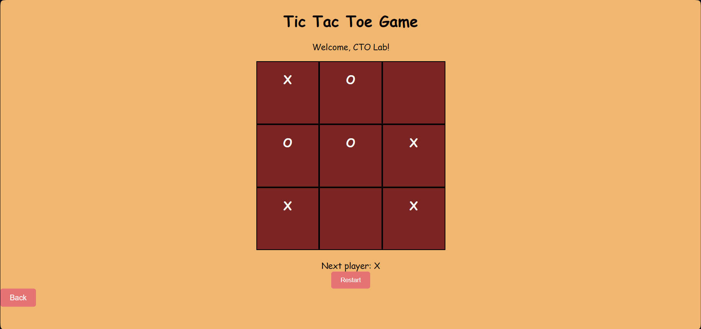
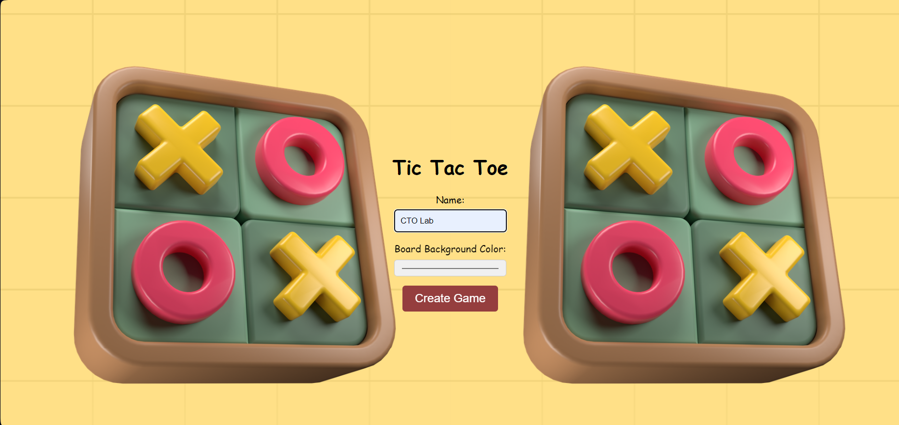
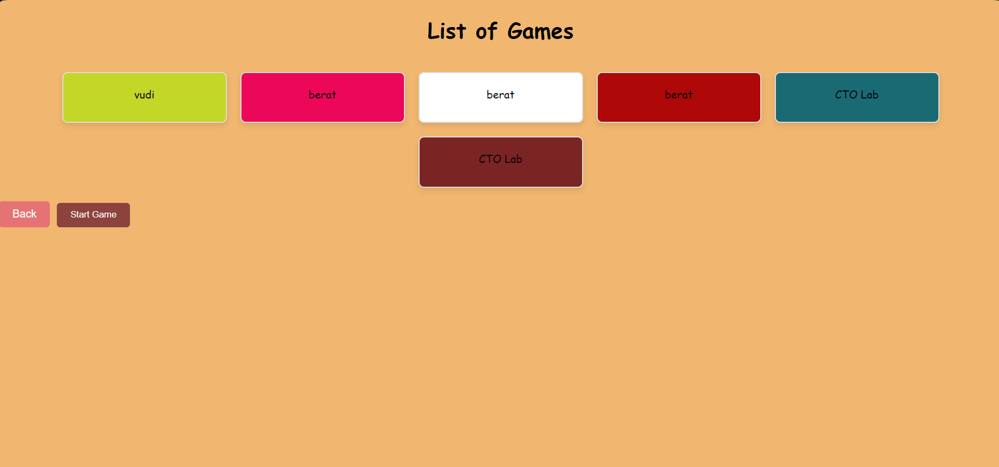

# Tic Tac Toe Game with OpenAI

This project includes a "Tic Tac Toe" game played with an artificial intelligence model developed by OpenAI. The game provides an interactive experience to the user and consists of three different screens.

## Screens

### 1.  Game Create Screen

In this screen, the user can enter their name and choose the background color of the game board.

It contains an input field for the user to enter their name and an option to choose the background color of the game board.

This information, along with an ID, is listed in localStorage along with the information entered by the user. At the same time, the information of the user logging in this section is stored in localStorage under a specific currentGameId.

currentGameId is an ID that remains constant throughout the game but changes when a new user logs in. Its purpose is to find the current user from our storage list named gameList and use their information in other screens.

### 2. Game List Screen

This screen lists the past games on your computer. Each game is defined with a name and color options.

Also it contains a system that displays the listed data in localStorage in card form. A card is added here for each user login.

### 3. Game Screen

This screen is where the actual game takes place. The user makes "X" moves, and OpenAI makes "O" moves. If the game ends in a draw, the game board is automatically reset. When won or lost, the user can start a new game by clicking the restart button.

On this page, the data filtered from the list through currentId is reflected.

Welcome [username], and the background color of the game board is created in this way.

The game is played with the game assistant. The assistant's instructions are as follows:

"You are a Tic Tac Toe assistant. You are the most professional Tic Tac Toe player in the world. You have a perfect strategy. Let's play Tic Tac Toe on a 3x3 board. We will play the game in array format ['', '', '', '', '', '', '', '', '']. Write your move in the array I send you, and when you are ready, send it back. Let's start. Provide your answers only as an array (I know you are a text-based artificial intelligence, so let's play this game text-based) and never send me any data expect your answer!"

Also, when the game ends in a draw, it automatically restarts.

## During the Project

The development process of the project and error resolution are entirely attributed to the chat-like nature. I shared my steps with the chat as much as possible, minimizing them. While some were resolved in a single question, some stubbornly did not, in which case I tried to solve the situation by explaining the general definition of a new chat project, then sharing the steps, and finally discussing the errors I encountered.

## Game Flow

The game provides an interactive experience to the user, but in some cases, due to thread fatigue, the game's response may be slow.

## How to Use

1. First, specify your name on the entry screen and choose the background color of the game board.
2. Check the past games on your computer on the game list screen.
3. Make "X" moves on the game screen and wait for OpenAI's "O" moves.
4. If the game ends in a draw, it automatically restarts. When won or lost, click the restart button to start a new game.

## Notes

- The game may experience delays in response time due to thread fatigue.
- Before running the project, go to the terminal or command prompt in the project folder and use the npm install command to install the necessary packages.

## Technologies

- The client side is written in React.js.
- Node.js and Express are used on the server side.

## Thanks

This game is developed using OpenAI's artificial intelligence models. Thanks, OpenAI!

## Video

Game video: [İzle](https://drive.google.com/drive/folders/1LyM10LWxwyzqxZRuQdxKQd1Ndba1M8Ha?usp=sharing)
